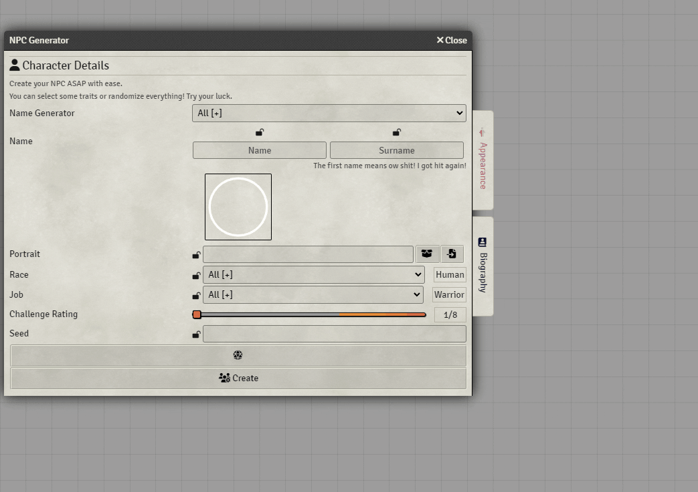

# Foundry VTT - NPC Generator for DnD 5e

Generate NPCs on the fly ASAP. Including names and character sheets, all randomly generated using an explendid algorithm. Plenty of races and _jobs_ to work with, dozens of name generators and providing a method for generating portraits as well.

> This module will no longer be supported after december, 2024

## Installation

In the setup screen, use the manifest URL, provided in your purchase, to install the module.

## How to Use

The primary way to open the application is through the **Generate NPC** button on the Actor's Directory Tab, on the sidebar.

You can also generate a NPC based on an actor using the contextmenu and clicking **Build NPC**. In this case the module will try identifying the npc attributes and copying any field it find into the application. This is useful for upgrading an NPC.

## Faq

##### What is a job?

Its like a class but for NPCs. Its a pseudo-class.

##### Why maximum CR is 12?

Because from that point on the NPCs would start resembling monsters, with legendary actions and/or too many hit points to feel anything 'humanoid'.

##### Is it possible to add more content? Spells, items, etc.

The module automatically looks for content in all compendiums. If you own a suplement you can add the spells or items in a compendium and the module will automatically judge and use them if they are found relevant.

##### How do I make suggestions or report bugs?

You can submit them at the [issues section](https://github.com/elizeuangelo/fvtt-module-npc-generator-dnd5e-faq/issues).

##### I believe an NPC is unbalanced...

Sometimes there is an _officially published_ similar NPC and its quite different from the a generated NPC, both in terms of **hit points** and **damage output**. I must say odds are the published NPC is the one who is unbalanced. You should check first who seems the most outlier from other similar CR NPCs.

That being said, if you still believe a generated NPC is unbalanced, you should open its character sheet and click on the **report button** on the menu. It will open the report form but will automatically fill the relevant information.

### Portraits

To configure portrait generation you need to create a folder like the one found in `npc-generator-dnd5e/imgs/portraits`. From there, enter the module configuration and select the folder in the `Portrait Directory` setting.

All images inserted into the directory with the correct format will be available as a portrait to be randomly generated.

#### Image Name Format

All images in the directory should have their names formatted as the examples in the `imgs/portraits` folder, the module uses their names as tags for matching pictures, following the rules:

-   All names should be in lower-case;
-   An underline (`_`) act as a separator for different tags, you can have as many tags as you want for any picture and might use spaces as well;
-   The tags from the entire folder becomes individual filters as well, so adding a new tag to any image also adds a new filter;
-   Jobs and races are automatically matched using their lower-case title;
-   If no match is found for the applied filters, no image is returned;

## License

This work is licensed under Foundry Virtual Tabletop EULA - Limited License Agreement for module development v 0.1.6.
